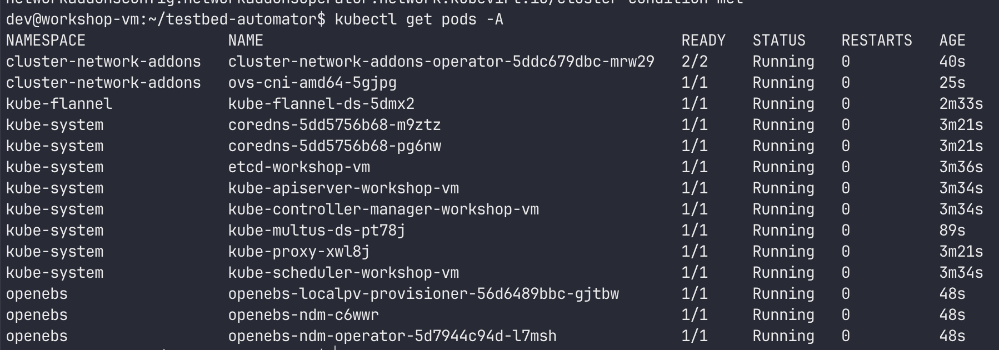

# testbed-automator
This project provides scripts to automate the setup and teardown of a Kubernetes cluster for deploying a 5G core network.

This repo is designed to be used with [free5gc-k8s](https://github.com/niloysh/free5gc-k8s) and [open5gs-k8s](https://github.com/niloysh/open5gs-k8s).


# Requirements
- Supported OS: **Ubuntu 22.04 LTS** (recommended); Ubuntu 20.04 is compatible but unmaintained.
- Minimum hardware: **4 cores, 4GB RAM**, and internet access.

# Quick Start
```bash
# Clone the repository
git clone https://github.com/niloysh/testbed-automator.git
cd testbed-automator

# Run the installation script
sudo ./install.sh
```
**Note**: Ensure you have sudo permissions. Run scripts as a regular user (not as root).

The `install.sh` script should take approximately 5 mintues to run to completion. On successful deployment, you should see all pods in **Running** state as shown below.



# Usage
Descriptions of the scripts in this repo are given below.

- `install.sh` : Automates the deployment of a single-node k8s cluster, configures cluster, installs various CNIs, configures ovs bridges and sets everything up for deployment of 5G core.

- `uninstall.sh`: Reverts changes made by install.sh, removing the Kubernetes cluster and configurations.

- `cleanup.sh`: Removes remants (old configuration files, CNIs) etc from previous installations of Kubernetes. Use this after `uninstall.sh` before running `install.sh` again.

- `worker-join-token.sh`: Run this on the **master** node to print out the command for adding worker nodes to the cluster.

**Note**: Run scripts as regular user with sudo permissions. Do not use **root**.

# Script Overview
Each function has a specific role in deploying the testbed. Below is a detailed description of each function to help understand its purpose and operation.

- `run-as-root`: Ensures the script is executed with superuser privileges. Essential for modifying system settings.
- `timer-sec`: Provides a timer for pauses between stages, allowing processes to complete fully before moving forward.
- `install-packages`: Installs essential packages and utilities. Each package has a role in the deployment, such as vim for file editing, iperf3 for network testing, and tcpdump for network packet analysis.
- `disable-swap`: Disables swap, a Kubernetes best practice to avoid conflicts with memory management.
- `disable-firewall`: Disables the firewall to prevent it from interfering with Kubernetes networking.
- `install-containerd`: Installs containerd, the container runtime for Kubernetes, and sets it up for systemd management.
- `setup-k8s-networking`: Configures networking kernel modules and parameters needed for Kubernetes to function optimally.
- `install-k8s`: Installs the core Kubernetes components (kubectl, kubeadm, kubelet) required for managing and deploying the cluster.
- `create-k8s-cluster`: Initializes the Kubernetes cluster, applies configurations, and allows scheduling on the control-plane node.
- `install-cni`: Installs Flannel, a CNI plugin, for basic Kubernetes pod networking.
- `install-multus`: Installs Multus, a meta CNI for multiple networking interfaces, which is useful for 5G use cases.
- `install-helm`: Installs Helm 3, a package manager for Kubernetes.
- `install-openebs`: Installs OpenEBS, a storage solution, and configures it as the default storage class.
- `setup-ovs-cni`: Installs and configures OpenVSwitch and the ovs-cni plugin for advanced networking setups in the testbed.

# Multi-node deployment
To deploy a multi-node Kubernetes cluster, start by setting up the master node using install.sh, and then add worker nodes.

1. **Set up the Master Node**:
Run install.sh on the intended master node as shown in the [Quick Start](#quick-start) section.

2. **Set up each Worker Node**: On each worker node, run the install.sh script with the `--worker` flag as follows.
    ```bash
    # Clone the repository
    git clone https://github.com/niloysh/testbed-automator.git
    cd testbed-automator

    # Run the installation script for the worker node
    sudo ./install.sh --worker
    ```

3. **Generate Join Token**:
    On the master node, execute:
    ```bash
    sudo ./worker-join-token.sh
    ```
    This will output a command that includes the token and IP address for the worker node to join the cluster.

4. **Join the Worker Nodes**:
On each worker node, run (with sudo) the join command generated by worker-join-token.sh on the master node. The command will look something like this:
    ```bash
    sudo kubeadm join <master-ip>:<port> --token <token> --discovery-token-ca-cert-hash <hash>
    ```

5.	Verify Node Status:
Back on the master node, check the status of all nodes:
    ```bash
    kubectl get nodes
    ```
    Each worker node should appear with the status **Ready**.

# Useful Resources and Commands

This project relies on several networking and Kubernetes tools that are essential for 5G deployments. Below are resources to help understand these tools better, along with some common commands.

## Key Technologies
- [Kubernetes](https://kubernetes.io/):  The orchestrator for containerized applications.
- [Multus CNI](https://github.com/k8snetworkplumbingwg/multus-cni): Enables multiple network interfaces in Kubernetes.
- [OpenVSwitch (OVS)](https://www.openvswitch.org/): A virtual switch for network virtualization.
- [OVS-CNI](https://github.com/k8snetworkplumbingwg/ovs-cni): A plugin that integrates OpenVSwitch with Kubernetes.

## Common Kubernetes Commands
```bash
# View all nodes in the cluster
kubectl get nodes

# View all pods in the default namespace
kubectl get pods

# View detailed info about a specific pod
kubectl describe pod <pod-name>

# List services in the namespace
kubectl get svc

# Delete a pod
kubectl delete pod <pod-name>
```
## Useful OVS Commands
```bash
# Show OVS bridges
ovs-vsctl show

# Add a new bridge
sudo ovs-vsctl add-br <bridge-name>

# Delete an OVS bridge
sudo ovs-vsctl del-br <bridge-name>
```


# Troubleshooting

## Common issues
- **Check Logs**: Each function logs output to help trace errors. Look for “RED” messages indicating critical failures.
- **Network Requirements**: Some components require network access (e.g., Helm, Kubernetes packages). Ensure the server can access the internet during the installation process.
- **Resource Limits**: Verify system resources meet minimum requirements. Kubernetes installations may fail with less than the recommended CPU and RAM.

For additional help, see [troubleshooting.md](troubleshooting.md)

# Contributing
Contributions are welcome! Please open an issue or submit a pull request. For larger changes, open an issue first to discuss the proposed updates.

## License

This repository is licensed under the [MIT License](LICENSE).


