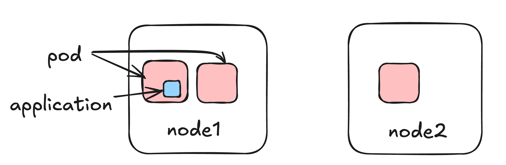
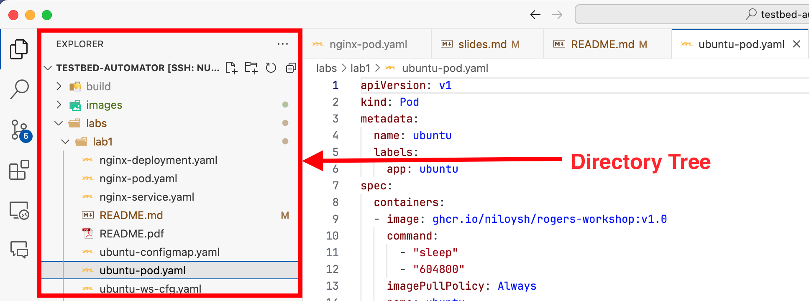
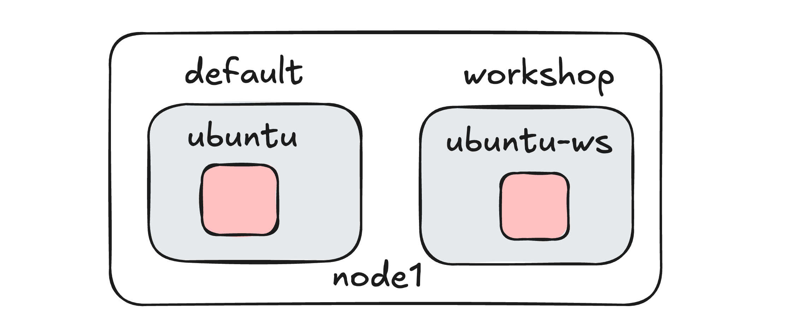
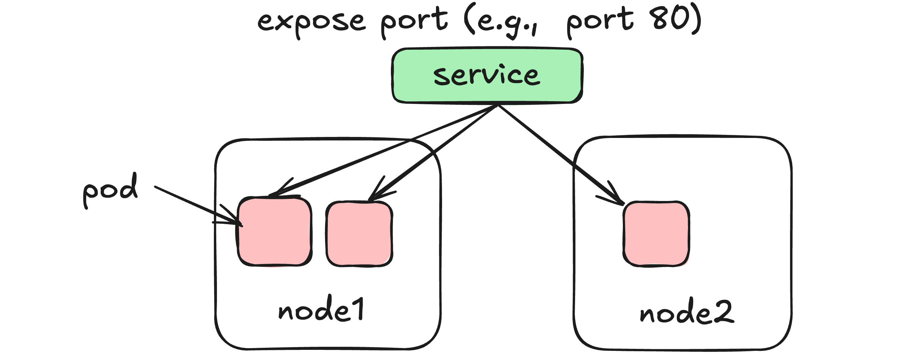
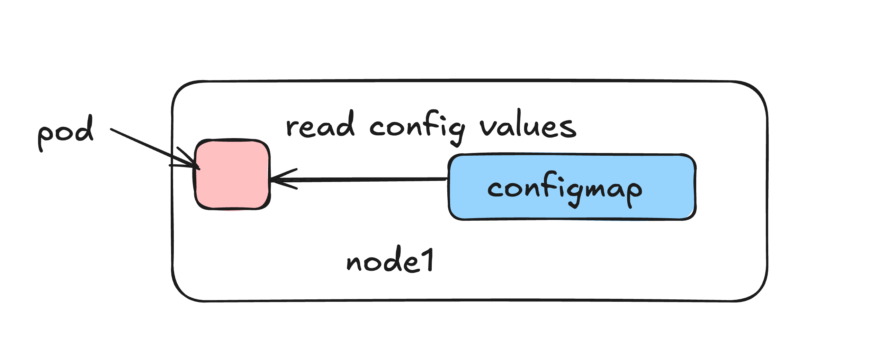
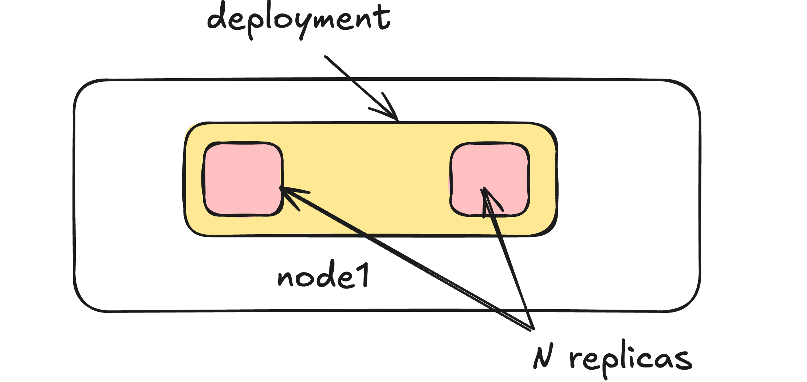

# Lab 1: Kubernetes Basics

In this lab, you will learn how to deploy containers, work with namespaces, set up services, use configmaps, and create deployments in Kubernetes. 

These skills will prepare you for deploying and managing applications, including the network functions (NFs) used in our 5G core network deployment.

---
# Deploy a simple Container
We will start with deploying a simple Ubuntu container from a Docker image.

This can be very helpful in debugging; it can easily let us install whatever tools we wish with `apt install <package_name>`.

For this lab, we will utilize the `ghcr.io/niloysh/rogers-workshop:v1.0` image, which is an Ubuntu-based image preloaded with a selection of commonly used tools, including `ping`, `curl`, etc.

---
# Pod
Pods are the smallest deployable units of computing that you can create and manage in Kubernetes.

A Pod is a group of one or more containers, with shared storage and network resources, and a specification for how to run the containers. Example applications running in Pods can be 5G network functions (NFs), web applications, etc.



---

# Looking at Source Code

Open the `testbed-automator` source code in the VSCode editor:
```bash
cd ~/testbed-automator
code .
```
In the directory tree, navigate to `labs/lab1/ubuntu-pod.yaml`



---
# The YAML manifest file (2/2)
Pods and other resources in Kubernetes can be deployed with a `YAML` manifest file. 
The `ubuntu-pod.yaml` file shown below deploys our `rogers-workshop` image as a pod.

```yaml
kind: Pod  <==== Type of Kubernetes resource
metadata:
  name: ubuntu  <==== Name of the Kubernetes resource
  labels:
    app: ubuntu
spec:
  containers:
  - image: ghcr.io/niloysh/rogers-workshop:v1.0  <==== Container image
...
```
---

# Deploy our first Pod

We can deploy our pod from the terminal as follows:
```bash
cd ~/testbed-automator/labs/lab1
kubectl apply -f ubuntu-pod.yaml
```
This may take some time to download the Ubuntu image and then deploy the pod. To check the status of your pod, you can use `kubectl get pods`. 

You should see output as below:

```
NAME     READY   STATUS    RESTARTS   AGE
ubuntu   1/1     Running   0          66s
```
Eventually the status should show up as `Running.`

---
# Using the pod
We can start up an interactive shell inside the container as follows:
```bash
kubectl exec -it ubuntu -- /bin/bash
```
Our `rogers-workshop` image already has the `ping` utility installed. Therefore, we can ping any IP address to check connectivity. For example,
```bash
root@ubuntu:/# ping 8.8.8.8 -c 2
PING 8.8.8.8 (8.8.8.8) 56(84) bytes of data.
64 bytes from 8.8.8.8: icmp_seq=1 ttl=61 time=4.62 ms
64 bytes from 8.8.8.8: icmp_seq=2 ttl=61 time=4.94 ms

--- 8.8.8.8 ping statistics ---
2 packets transmitted, 2 received, 0% packet loss, time 1003ms
rtt min/avg/max/mdev = 4.619/4.781/4.943/0.162 ms
```
**Note**: Exit the shell inside the container by typing `exit`.

---

# Namespaces - Introduction
<style> img[alt~="center"] { display: block; margin: 0 auto; } </style>

Namespaces allow you to organize and isolate resources within a Kubernetes cluster. Think of them as "virtual clusters" inside your main cluster, letting you separate environments or applications.



So far we have deployed pods in the `default` namespace. Next, let's create a namespace for our workshop.

---

# Namespaces - Creation

Let's create a namespace called `workshop` where we can deploy our resources without cluttering the `default` namespace.

To create the namespace, use the following command:
```bash
kubectl create namespace workshop
```
Verify that it has been created by listing namespaces:

```bash
kubectl get namespaces
```
---
# Namespaces - Deploy a Pod

Let's look at the `ubuntu-ws.yaml` file:
```yaml
...
metadata:
  name: ubuntu-ws
  namespace: workshop
...
```
We have specified the `namespace` inside the `metadata`. Let's go ahead and deploy it: 
```bash
kubectl apply -f ubuntu-ws.yaml
```
To check the status of our new pod, add `-n <namespace>` to the `kubectl get pods`:
```bash
kubectl get pods -n workshop
```

---

# Services - Introduction
<style> img[alt~="center"] { display: block; margin: 0 auto; } </style>
Services allow you to expose a set of Pods as a network service, making it possible for other resources to communicate with them. 

In our 5G core network, network functions communicate with each other using services.



---

# Services - Deploy an nginx Pod
Let's deploy an `nginx` pod to serve HTTP traffic on port 80. This will allow us services. In VSCode, find `labs/lab1/nginx-pod.yaml`:
```yaml
kind: Pod
metadata:
  name: nginx
...
```
We can deploy it as follows:
```bash
kubectl apply -f nginx-pod.yaml
```
Check the deployment status using `kubectl get pods -n workshop`:
```
NAME        READY   STATUS    RESTARTS   AGE
nginx       1/1     Running   0          92s
ubuntu-ws   1/1     Running   0          14m
```
---
# Services - Expose nginx Pod
Next, let's expose the Nginx pod with a ClusterIP service (the default type) to allow other pods in the cluster to reach it.

Find the `labs/lab1/nginx-service.yaml` file. This defines a service that will expose our Nginx pod internally within the workshop namespace.
```yaml
apiVersion: v1
kind: Service
metadata:
  name: nginx-service
  namespace: workshop
...
  ports:
    - protocol: TCP
      port: 80
      targetPort: 80
  type: ClusterIP
```
---
# Services - Deploy the Service
The `labs/lab1/nginx-service.yaml` file contains the above yaml. We can apply it as follows:
```bash
kubectl apply -f nginx-service.yaml
```
To confirm that the service is running, check the services in the workshop namespace:
```bash
kubectl get services -n workshop
```
You should see output as follows:
```
NAME            TYPE        CLUSTER-IP      EXTERNAL-IP   PORT(S)   AGE
nginx-service   ClusterIP   10.108.24.210   <none>        80/TCP    8s
```
We can see from the output that port `80` inside the pod is exposed to the cluster.

---

# Services - Verify the Connection
To test the service, you can use our `ubuntu-ws` pod to `curl` the `nginx-service` and check if it is accessible. 

Open up a bash shell inside the container:
```bash
kubectl exec -n workshop -it ubuntu-ws -- /bin/bash
```
From inside the container, try accessing the `nginx-service` on port `80`:
```
curl nginx-service:80
```
You should see a HTML document with the line `<title>Welcome to nginx!</title>`.

**Tip**: Exit the container by typing `exit`.


---

# ConfigMaps - Introduction

ConfigMaps are used to store configuration data separately from application code. They allow you to manage environment-specific settings without altering your container image.

We will use ConfigMaps to store configurations for each network function (e.g., SMF, AMF) when we deploy our 5G core.



---

# ConfigMaps - Creation

Let's create a ConfigMap to store environment variables for our Ubuntu pod. This will store some basic configuration data, like a `MESSAGE` and a `SLEEP_DURATION`.

The `labs/lab1/ubuntu-configmap.yaml` contains the following content:
```yaml
apiVersion: v1
kind: ConfigMap
...
data:
  MESSAGE: "Hello from ConfigMap!"
  SLEEP_DURATION: "604800"
```
We can apply the ConfigMap as follows:
```bash
kubectl apply -f ubuntu-configmap.yaml
```
---
# ConfigMaps - Using them in a Pod

Now, let's create a new pod that will use this configmap. Look at the `labs/lab1/ubuntu-ws-cfg.yaml` file:
```yaml
env:
- name: MESSAGE
  valueFrom:
    configMapKeyRef:
      name: ubuntu-config
      key: MESSAGE
```
We can deploy this as follows:
```bash
kubectl apply -f ubuntu-ws-cfg.yaml
```

Verify the pod’s logs to see the ConfigMap values being used:
```bash
kubectl logs ubuntu-ws-cfg -n workshop
```
---
# Deployment - Introduction
Deployments manage a set of identical Pods (replicas) for scalability, high availability, and ease of updates.



---

# Deployment - Creation
Let's create a Deployment to manage 2 replicas of an `nginx` container. Look at the `labs/lab1/nginx-deployment.yaml`:

```yaml
apiVersion: apps/v1
kind: Deployment
...
spec:
  replicas: 2
...
```

Apply the Deployment:

```bash
kubectl apply -f nginx-deployment.yaml
```

Check the status of deployment Pods:

```bash
kubectl get pods -l app=nginx -n workshop
```
---
# Next Steps

Congratulations, you are now familiar with some of the basic components of Kubernetes we will use for our 5G network deployment.

Continue to the [next lab](https://niloysh.github.io/testbed-automator/labs/lab2/README.pdf) of this workshop.
