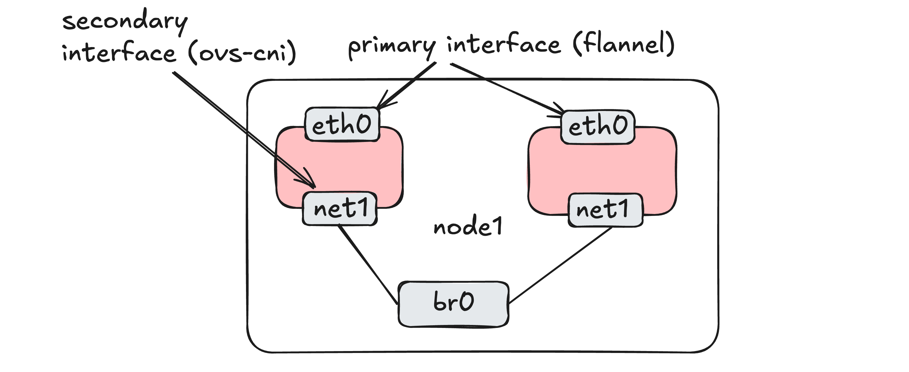
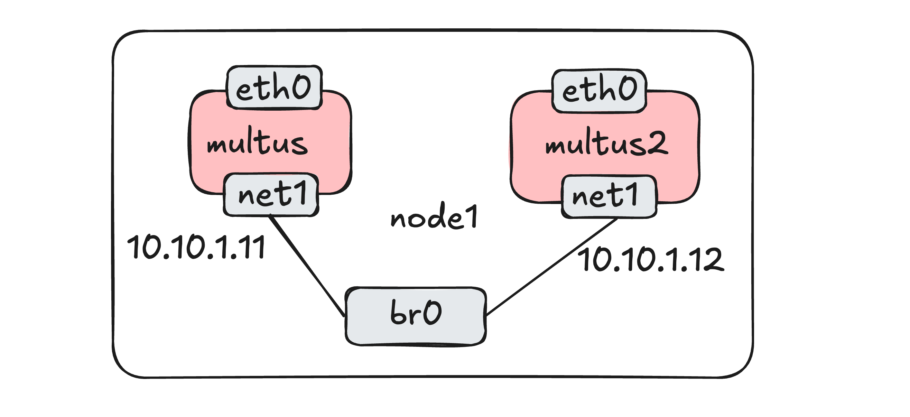

# Lab 2: Advanced Kubernetes Networking with Multus and OVS-CNI
In this lab, you will learn how to enhance Kubernetes pod networking using Multus to add secondary network interfaces and Open Virtual Switch CNI (OVS-CNI) to manage virtual network connections. 

This setup is used in our 5G core network architectures to support traffic isolation for different interfaces between pods.

---

# About OVS 

- **What is OVS?** A software-based switch enabling network connectivity in virtualized environments, such as VMs, containers, and physical devices.

- **Importance in 5G:** Open vSwitch can be used alongside software-defined networking (SDN) controllers such as ONOS to enable slicing and traffic prioritization in the transport network.

- **Container Networking with OVS-CNI:** OVS-CNI integrates OVS in Kubernetes, supporting multi-interface pods and advanced network setups.

---

# Prerequisites
Change into the `lab2` directory, where you can find all required files for this lab.
```bash
cd ~/testbed-automator/labs/lab2
```
**Tip**: From any directory, you can go back one directory by using the `cd ..` command.
Ensure that Multus and OVS-CNI are installed and configured in your Kubernetes cluster. Verify by running:
```bash
kubectl get pods -A | grep -E 'multus|ovs'

cluster-network-addons   ovs-cni-amd64-5gjpg   1/1     Running
kube-system              kube-multus-ds-pt78j  1/1     Running
```
You should see Multus and OVS pods and they should be in `Running` state.

---

# Creating OVS  Bridges
Let's create one OVS bridge to understand the fundamentals of adding secondary interfaces to pods using OVS-CNI.

Create an OVS bridge (`br0`) on your host.
```
sudo ovs-vsctl add-br br0
```
You can check if the bridge has been created using:
```bash
sudo ovs-vsctl show
```

**Note**: If you have used the testbed-automator script, you will also see three other bridges - `n2br`, `n3br` and `n4br`, which will be used later when we deploy our 5G core network.

---

# Create NADs with Multus
<style> img[alt~="center"] { display: block; margin: 0 auto; } </style>
Network Attachment Definitions (NADs) allow you to add secondary network interfaces to Kubernetes pods using Multus. 

In this lab, we will define a NAD to add an additional network interface to an Ubuntu pod.



---

# Create a simple NAD

We will use `labs/lab2/secondary-network.yaml` to create our NAD which will associate our secondary interface with the OVS bridge we just created.

```yaml
kind: NetworkAttachmentDefinition
spec:
  config: '{
    "cniVersion": "0.3.1",
    "type": "ovs",
    "bridge": "br0",
    ...
```

```bash
kubectl apply -f secondary-network.yaml
```
You can verify whether they have been deployed using:
```
kubectl get network-attachment-definitions -n workshop
```
---
# Deploy Pod with a Secondary Interface

Let's look at `labs/lab2/ubuntu-multus-pod.yaml`:

```yaml
apiVersion: v1
kind: Pod
metadata:
  name: ubuntu-multus
  annotations:
    k8s.v1.cni.cncf.io/networks: '[ 
      { "name": "secondary-network", "ips": [ "10.10.1.11/24" ]  } ]'
...
```

Deploy the pod as follows:

```bash
kubectl apply -f ubuntu-multus-pod.yaml
```
Verify that the pod is deployed and running as follows:

```
kubectl get pods -n workshop
```
---

# Verify the Secondary Interface
Once the pod is running, verify the secondary interface, by executing:
```bash
kubectl exec -it -n workshop ubuntu-multus -- ip a
```
This runs the `ip a` command from inside the `ubuntu-multus` pod.

You should see an additional interface `net1` besides the default `eth0`, with an IP address `10.10.1.11` as specified in `secondary-network.yaml`.

---

# Testing Connectivity between Pods
<style> img[alt~="center"] { display: block; margin: 0 auto; } </style>

To test if our secondary interface is working, we can deploy a topology as follows using OVS-CNI. The secondary interface `net1` will connect both `ubuntu-multus` and `ubuntu-multus2` pods.



---

# Deploy a second Ubuntu Pod
Let's create another pod with a similar configuration, but different IP addresses. Look at the the `labs/lab2/ubuntu-multus-pod2.yaml` file. Here the `metadata -> annotations -> k8s.v1.cni.cncf.io/networks -> ips` has been changed to `10.10.1.12`:


```yaml
apiVersion: v1
kind: Pod
metadata:
  name: ubuntu-multus2
  annotations:
    k8s.v1.cni.cncf.io/networks: '[ 
      { "name": "secondary-network", "ips": ["10.10.1.12/24"] 
      } ]'
...
```
Apply the configuration
```bash
kubectl apply -f ubuntu-multus-pod2.yaml
```
---

# Verify connectivity

Once the second pod is running, ping the IP of `ubuntu-multus2`'s secondary interface from the first multus pod:
```bash
kubectl exec -it ubuntu-multus -n workshop -- ping 10.10.1.12 -c 4
```

You should see the pings going through.

Congratulations! You have successfully configured multi-interface networking in Kubernetes using OVS-CNI. Now you are ready to deploy the 5G network!
Continue to deploying the 5G network with [open5gs-k8s](https://niloysh.github.io/open5gs-k8s/slides.pdf).

