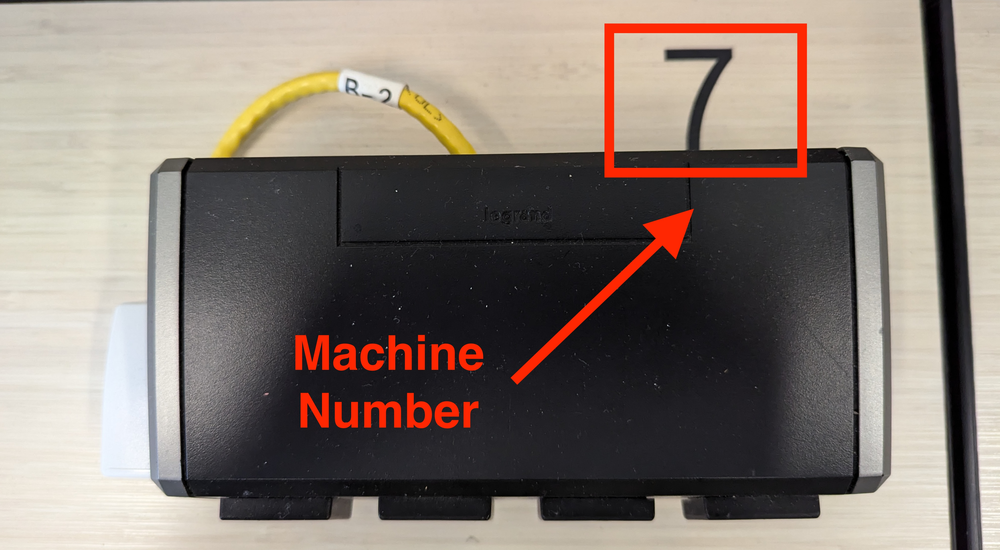
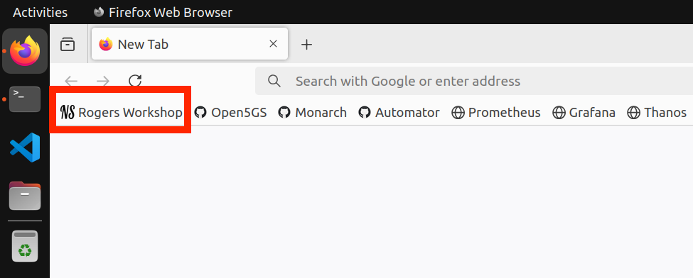
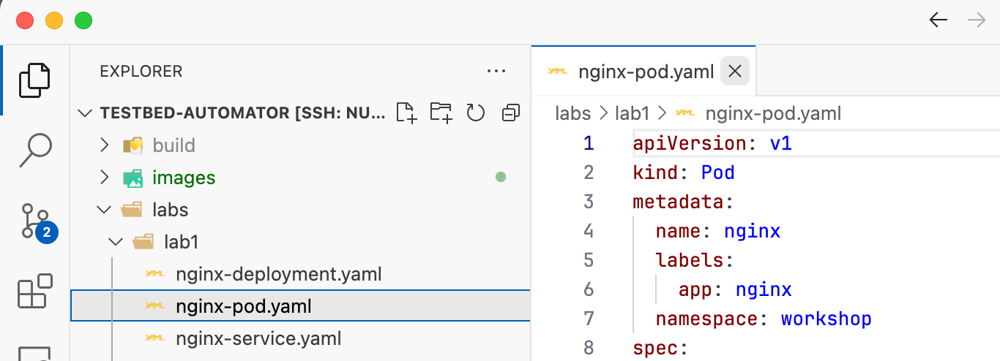
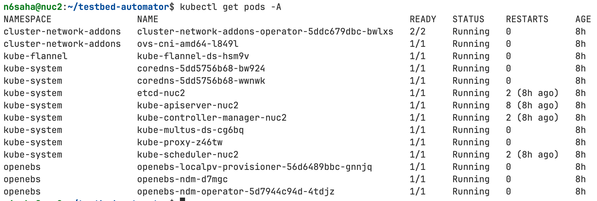

# Getting Started with the Workshop (2/5)

**2. Find your Machine Number** 
Use the same machine throughout the workshop. Find your machine number on the label behind the power bar.



---
# Getting Started with the Workshop (3/5)
<style> img[alt~="center"] { display: block; margin: 0 auto; } </style>

**3. Accessing Workshop Resources**
- Open **Firefox** and select the **Rogers Workshop** bookmark in the bookmarks bar. This will take you to the workshop landing page, which includes the schedule, slides, source code, and additional resources.



--- 
# Getting Started with the Workshop (4/5)

**4. Navigating to your Home Directory**

All workshop files will be stored in your home directory `(~)`. You can quickly navigate to this location from anywhere by typing in the terminal:
```bash
cd ~
```
**5. Downloading the Workshop Code Repositories**
Use `git clone` to download the workshop source code. Make sure to run this command from your home directory.
```
cd ~
git clone <repository_url>
```
---
# Getting Started with the Workshop (5/5)

**6. Using VS Code to View and Edit Code**

Open each repository in the VS Code text editor as we proceed through the workshop. Once you are inside the repo folder in the terminal, you can open it by:
```bash
code .
```



---
# Ready to Start?
Ask for help if you encounter any issues.

---
# Session Overview
Welcome! In this session, you'll deploy and manage a 5G core network on Kubernetes using Open5GS, an open-source, 3GPP-compliant 5G core with support for network slicing.

**Key Activities**
- **Kubernetes Setup:** Use the **Testbed Automator** script to initialize your Kubernetes cluster and install essential tools.
- **Core Network Deployment:** Deploy Open5GS with network slicing capabilities.

By the end of this session, you'll have hands-on experience with 5G core deployment, and network slicing.

---
# Testbed Automator Script Overview
**Purpose**: Automates the setup and configuration of a testbed environment.

**Key Tasks**
- Install necessary software packages
- Set up Kubernetes and networking tools
- Configure various networking plugins like Flannel, Multus, Open vSwitch (OVS)
- Install storage management systems (OpenEBS)

---
# Technologies and Tools
**Kubernetes**
- **Kubeadm:** Initializes the Kubernetes cluster.
- **Kubectl:** CLI tool to interact with the Kubernetes cluster.
- **Helm:** Package manager for Kubernetes applications.

**Networking**
- **Flannel:** Container Network Interface (CNI) for Kubernetes.
- **Multus:** Meta-CNI for deploying multiple network interfaces in containers.
- **Open vSwitch (OVS):** Used for advanced networking and bridge management.
	
---
# Technologies and Tools (Cont.)
**Containerization**
- **Containerd:** Container Runtime Interface (CRI) compatible container runtime. 

    - A container runtime builds on top of operating system kernel features and improves container management with an abstraction layer.

    - Container runtime interface (CRI) is a plugin interface that lets the kubelet - an agent that runs on every node in a Kubernetes cluster - use more than one type of container runtime.

**Storage**
- **OpenEBS:** Manages the storage available on each of the Kubernetes nodes and uses that storage to provide Local or Replicated Persistent Volumes to Stateful workloads.

---
# Deploying `testbed-automator`
You can use the `install.sh` script as follows:
```bash
cd ~
git clone https://github.com/niloysh/testbed-automator
cd testbed-automator
./install.sh
```


**Note**: Do NOT run the `install.sh` script as `sudo` or `root.` Run it as a regular user and provide the password when prompted.

---
# Verify Deployment

On completion, run `kubectl get pods -A` you should see:



After confirming deployment, proceed with [Lab 1](https://niloysh.github.io/testbed-automator/labs/lab1/README.pdf) to deepen your understanding of the tools you've just deployed.


