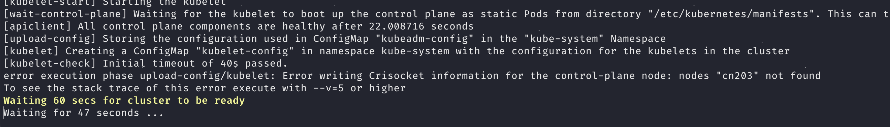
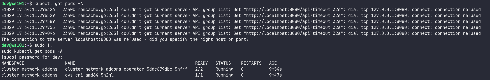

# Troubleshooting

## kudeadm init hangs

Check kubelet status
```bash
sudo systemctl status --no-pager --full kubelet.service
```

If you get error like the following:

> OCI runtime create failed: expected cgroupsPath to be of format \"slice:prefix:name\" for systemd cgroups, got \"/kubepods/burstable/..."

Then remove the containerd configuration and restart containerd.

```
sudo rm /etc/containerd/config.toml
systemctl restart containerd
```

## Error writing to crisocket


This can happen if you had a previous installation of Kubernetes.
Reset kubeadm and cleanup remnants of previous installation, as follows:
```
sudo ./cleanup.sh
```
Then run `install.sh` again. It after installation, kubernetes pods show as pending, do a reboot.

## Pods Ran Out of IP Range

If CoreDNS pods (or other system pods) are stuck in the `ContainerCreating` state, it may be due to the scheduler running out of IP ranges. This issue can occur after multiple failed installations.

To verify, run:
```bash
kubectl describe pod <pod_name> -n kube-system
```

If you see an error indicating that the scheduler ran out of IP ranges, perform a cleanup by running:

```
sudo ./cleanup.sh
```
This will reset any leftover configurations. Afterward, rerun install.sh to set up the cluster again.

## Kubectl only works with sudo


Copy the Kubernetes admin.conf file to your home directory using
```bash
sudo ./run-kubectl-without-sudo.sh
```